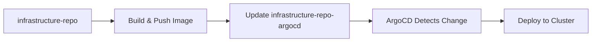
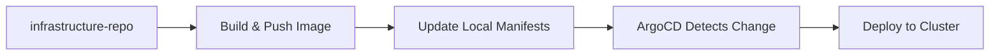

# Cross-Repository GitOps Integration Strategy

## Repository Structure and Package Locations

### Package Distribution Across Repositories

| Package | Source Repository | Container Image | ArgoCD Config Location |
|---------|------------------|-----------------|----------------------|
| app1 | infrastructure-repo-argocd | ghcr.io/triplom/app1 | infrastructure-repo-argocd/apps/app1 |
| app2 | infrastructure-repo-argocd | ghcr.io/triplom/app2 | infrastructure-repo-argocd/apps/app2 |
| external-app | **infrastructure-repo** | ghcr.io/triplom/external-app | **infrastructure-repo**/apps/external-app |
| nginx | **k8s-web-app-php** | ghcr.io/triplom/nginx | **k8s-web-app-php**/k8s/nginx |
| php-fpm | **k8s-web-app-php** | ghcr.io/triplom/php-fpm | **k8s-web-app-php**/k8s/php-fpm |

## GitOps Pattern: Two Approaches

### Approach 1: Centralized Config Repository (Current)
- **All Kubernetes manifests** stored in `infrastructure-repo-argocd`
- **External repositories** push image updates to centralized config repo
- **ArgoCD** monitors only the centralized config repository



### Approach 2: Distributed Config per Repository (Alternative)
- **Each repository** contains its own Kubernetes manifests
- **ArgoCD** monitors multiple repositories directly
- **No cross-repository updates** needed



## Current Implementation Status

### ✅ Working: Centralized Approach
- **infrastructure-repo-argocd**: Contains configs for all 4 packages
- **External repositories**: Push image updates via CONFIG_REPO_PAT
- **ArgoCD ApplicationSets**: Point to external repos for manifest sources

### 🔧 Issue: Mixed Approach
Currently we have a **mixed approach** that's causing confusion:
- ApplicationSets point to external repos for manifests
- But cross-repository updates push to centralized repo
- This creates a mismatch between where ArgoCD looks vs where updates go

## Resolution Strategy

### Option A: Full Centralized (Recommended)
1. **Keep all manifests** in `infrastructure-repo-argocd`
2. **Update ApplicationSets** to point to centralized repo
3. **External repos** continue pushing updates to centralized repo
4. **Single source of truth** for all Kubernetes configurations

### Option B: Full Distributed
1. **Move manifests** to their respective source repositories
2. **Update ApplicationSets** to point to source repos
3. **Remove cross-repository updates**
4. **Each repo manages** its own Kubernetes configurations

## Implementation Plan: Centralized Approach

### Phase 1: Fix ApplicationSet Sources ✅
- external-app ApplicationSet → `https://github.com/triplom/infrastructure-repo-argocd.git`
- php-web-app ApplicationSet → `https://github.com/triplom/infrastructure-repo-argocd.git`

### Phase 2: Ensure Manifest Availability
- Create/verify external-app manifests in infrastructure-repo-argocd
- Create/verify php-web-app manifests in infrastructure-repo-argocd

### Phase 3: Configure Cross-Repository CI/CD
- infrastructure-repo builds external-app → pushes to GHCR → updates infrastructure-repo-argocd manifests
- k8s-web-app-php builds nginx+php-fpm → pushes to GHCR → updates infrastructure-repo-argocd manifests

### Phase 4: ArgoCD Repository Access
- Ensure ArgoCD has access to all required repositories
- Configure repository secrets for external repos if needed

## Cross-Repository CI/CD Workflow

### infrastructure-repo (external-app)
```yaml
# .github/workflows/ci-pipeline.yaml
steps:
  - name: Build and push external-app
    # ... build steps ...
  
  - name: Update centralized config
    run: |
      git clone https://github.com/triplom/infrastructure-repo-argocd.git
      cd infrastructure-repo-argocd
      # Update apps/external-app/base/deployment.yaml with new image
      # Commit and push changes
```

### k8s-web-app-php (nginx + php-fpm)
```yaml
# .github/workflows/ci-pipeline.yaml
steps:
  - name: Build and push nginx + php-fpm
    # ... build steps ...
  
  - name: Update centralized config
    run: |
      git clone https://github.com/triplom/infrastructure-repo-argocd.git
      cd infrastructure-repo-argocd
      # Update apps/php-web-app/base/nginx-deployment.yaml
      # Update apps/php-web-app/base/php-deployment.yaml
      # Commit and push changes
```

## Benefits of Centralized Approach

1. **Single Source of Truth**: All Kubernetes configs in one place
2. **Simplified ArgoCD Setup**: Monitors one repository
3. **Cross-Application Dependencies**: Easy to manage dependencies between apps
4. **Consistent Gitops Practices**: Uniform configuration management
5. **Academic Clarity**: Clear separation of concerns for thesis evaluation

## Next Steps

1. ✅ Fix ApplicationSet repository references
2. ✅ Verify manifest availability in centralized repo
3. 🔧 Configure external repository CI/CD pipelines
4. 🔧 Test end-to-end GitOps workflow
5. 🔧 Validate ArgoCD application deployments

This ensures all 4 packages work seamlessly through the centralized GitOps approach.