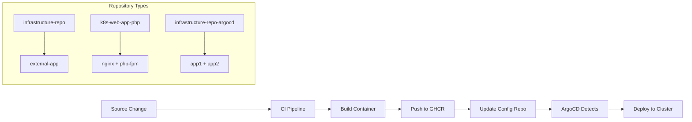

# Cross-Repository Pipeline Integration for 4 Packages

## Architecture Overview

This document outlines the cross-repository pipeline integration for all 4 packages across 3 repositories:

### Package Distribution
```
Repository: infrastructure-repo-argocd (Main Config Repo)
├── app1 → ghcr.io/triplom/app1:latest
└── app2 → ghcr.io/triplom/app2:latest

Repository: infrastructure-repo (External Infrastructure)
└── external-app → ghcr.io/triplom/external-app:latest

Repository: k8s-web-app-php (PHP Application)
├── nginx → ghcr.io/triplom/nginx:latest
└── php-fpm → ghcr.io/triplom/php-fpm:latest
```

### Cross-Repository Integration Pattern

Each repository follows the **pull-based GitOps pattern**:
1. **Source repositories** (infrastructure-repo, k8s-web-app-php) build images
2. **Config updates** pushed to infrastructure-repo-argocd via CONFIG_REPO_PAT
3. **ArgoCD detects** changes and deploys automatically

## Pipeline Integration Requirements

### 1. GitHub Secrets Required (All Repositories)

```bash
# Container Registry Authentication
GHCR_TOKEN=ghp_xxxxxxxxxxxxxxxxxxxx  # GitHub PAT with packages:write

# Cross-Repository Updates
CONFIG_REPO_PAT=ghp_xxxxxxxxxxxxxxxxxxxx  # GitHub PAT with repo:write

# Cluster Access (Optional - for direct validation)
KUBECONFIG_dev=<base64-encoded-kubeconfig>
KUBECONFIG_qa=<base64-encoded-kubeconfig>
KUBECONFIG_prod=<base64-encoded-kubeconfig>
```

### 2. Package Build and Update Matrix

| Package | Repository | Build Context | Update Target | ArgoCD App |
|---------|------------|---------------|---------------|------------|
| app1 | infrastructure-repo-argocd | `src/app1/` | `apps/app1/base/deployment.yaml` | app1-{env} |
| app2 | infrastructure-repo-argocd | `src/app2/` | `apps/app2/base/deployment.yaml` | app2-{env} |
| external-app | infrastructure-repo | `apps/external-app/` | `apps/external-app/base/deployment.yaml` | external-app-{env} |
| nginx | k8s-web-app-php | `nginx/` | `apps/php-web-app/base/nginx-deployment.yaml` | php-web-app-{env} |
| php-fpm | k8s-web-app-php | `php-fpm/` | `apps/php-web-app/base/php-deployment.yaml` | php-web-app-{env} |

## Current Status Analysis

### ✅ Working Packages
- **app1**: Fully operational in dev environment
- **app2**: Code exists, needs pipeline run to fix ImagePullBackOff

### 🔧 Needs Configuration
- **external-app**: Repository pipeline needs synchronization
- **nginx**: Multi-container build with php-fpm
- **php-fpm**: Multi-container build with nginx

## Integration Implementation Plan

### Phase 1: Validate Current Infrastructure-Repo-ArgoCD ✅
- app1 pipeline: Working
- app2 pipeline: Ready for testing

### Phase 2: Configure External Repository (infrastructure-repo)
- Sync CI/CD pipeline with main repo template
- Configure external-app build and push
- Set up cross-repository manifest updates

### Phase 3: Configure PHP Repository (k8s-web-app-php)
- Multi-container build (nginx + php-fpm)
- Cross-repository configuration updates
- ArgoCD integration via ApplicationSet

### Phase 4: End-to-End Testing
- Trigger builds across all repositories
- Validate ArgoCD synchronization
- Test multi-environment deployments

## ArgoCD Application Structure

```yaml
# Main Repository Applications
app1-dev/qa/prod    (infrastructure-repo-argocd)
app2-dev/qa/prod    (infrastructure-repo-argocd)

# External Repository Applications  
external-app-dev/qa/prod    (infrastructure-repo)

# PHP Repository Applications
php-web-app-dev/qa/prod     (k8s-web-app-php)
  └── Contains: nginx + php-fpm containers
```

## Cross-Repository Update Flow



## Validation Commands

```bash
# Check all applications
kubectl get applications -n argocd

# Check container images
docker pull ghcr.io/triplom/app1:latest
docker pull ghcr.io/triplom/app2:latest  
docker pull ghcr.io/triplom/external-app:latest
docker pull ghcr.io/triplom/nginx:latest
docker pull ghcr.io/triplom/php-fpm:latest

# Check pod deployments
kubectl get pods --all-namespaces | grep -E "(app1|app2|external|php|nginx)"
```

## Next Steps

1. **Test Current Setup**: Trigger app1/app2 pipelines to validate working setup
2. **Configure External Repo**: Apply pipeline template to infrastructure-repo
3. **Configure PHP Repo**: Set up multi-container builds
4. **End-to-End Validation**: Test complete GitOps workflow across all repositories

This creates a unified GitOps workflow where all 4 packages can be built, deployed, and managed through ArgoCD's pull-based approach.