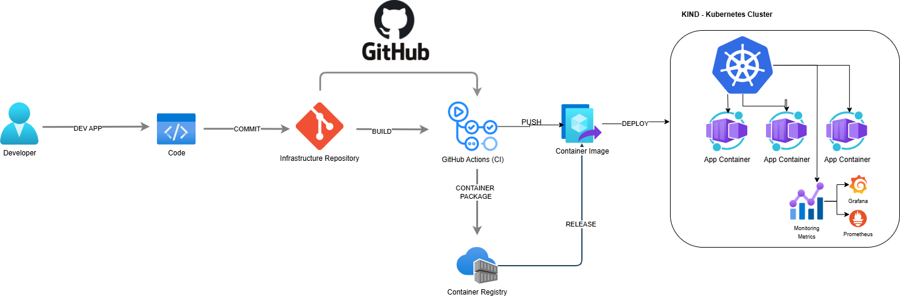

# Push-Based GitOps with KIND and Prometheus Monitoring


A complete implementation of push-based GitOps using KIND (Kubernetes IN Docker) clusters with comprehensive monitoring through the kube-prometheus-stack.

## 📋 Table of Contents

- [Overview](#-overview)
- [Architecture](#️-architecture)
- [Prerequisites](#-prerequisites)
- [Getting Started](#-getting-started)
  - [Setting Up KIND Clusters](#setting-up-kind-clusters)
  - [Local Registry Configuration](#local-registry-configuration)
  - [GitHub Repository Setup](#github-repository-setup)
- [Repository Structure](#-repository-structure)
- [Deployment Workflows](#-deployment-workflows)
  - [Infrastructure Deployment](#infrastructure-deployment)
  - [Monitoring Stack Deployment](#monitoring-stack-deployment)
  - [Application Deployment](#application-deployment)
- [Monitoring & Observability](#-monitoring--observability)
  - [Accessing Dashboards](#accessing-dashboards)
  - [Metrics & Alerts](#metrics--alerts)
- [Multi-Environment Strategy](#-multi-environment-strategy)
- [Troubleshooting](#-troubleshooting)
- [Contributing](#-contributing)
- [License](#-license)

## 🌐 Overview

This repository implements a push-based GitOps approach using GitHub Actions to deploy infrastructure and applications to Kubernetes clusters. Unlike pull-based GitOps solutions (like ArgoCD or Flux), this approach triggers deployments through CI/CD pipelines when changes are detected in the Git repository.

**Key Features:**

- Local KIND clusters for development, QA, and production environments
- Push-based GitOps using GitHub Actions workflows
- Comprehensive monitoring with Prometheus, Grafana, and AlertManager
- Multi-environment deployment strategy with proper separation of concerns
- Ingress management with cert-manager for SSL/TLS

## 🏛️ Architecture



The architecture consists of three main components:

1. **Source of Truth**: Git repository containing infrastructure and application configurations
2. **CI/CD Pipeline**: GitHub Actions workflows that detect changes and apply them
3. **Runtime**: KIND clusters running in Docker containers

**Workflow:**

1. Developer commits changes to the repository
2. GitHub Actions detects changes and triggers appropriate workflows
3. CI/CD pipeline applies changes to the appropriate environment
4. Monitoring stack collects metrics and displays them in Grafana

## 🧰 Prerequisites

- [Docker](https://www.docker.com/get-started) (v20.10+)
- [kubectl](https://kubernetes.io/docs/tasks/tools/) (v1.24+)
- [kind](https://kind.sigs.k8s.io/docs/user/quick-start/#installation) (v0.17+)
- [Helm](https://helm.sh/docs/intro/install/) (v3.9+)
- [GitHub account](https://github.com/) with repository access
- [yq](https://github.com/mikefarah/yq) for YAML processing

## 🚀 Getting Started

### Setting Up KIND Clusters

Clone the repository and run the KIND setup script:

```bash
git clone https://github.com/your-username/infrastructure-repo.git
cd infrastructure-repo
chmod +x kind/setup-kind.sh
./kind/setup-kind.sh
```

This creates three separate Kubernetes clusters:

- `dev-cluster`: For development and testing
- `qa-cluster`: For quality assurance and pre-production
- `prod-cluster`: For production workloads

### Local Registry Configuration

Set up the local container registry:

```bash
chmod +x infrastructure/local-registry/setup-registry.sh
./infrastructure/local-registry/setup-registry.sh
```

### GitHub Repository Setup

1. Push the repository to GitHub
2. Configure GitHub Secrets for cluster access
   - Go to your GitHub repository → Settings → Secrets and Variables → Actions
   - Add the following secrets:
     - `KUBECONFIG_DEV`: Base64-encoded kubeconfig for dev cluster
     - `KUBECONFIG_QA`: Base64-encoded kubeconfig for QA cluster
     - `KUBECONFIG_PROD`: Base64-encoded kubeconfig for production cluster

   To encode your kubeconfig files:

```bash
   base64 -w 0 dev-cluster-kubeconfig > dev-cluster-kubeconfig-base64.txt
   # Copy the contents of dev-cluster-kubeconfig-base64.txt to the KUBECONFIG_DEV secret
```

## 📂 Repository Structure

```bash
infrastructure-repo/
├── .github/workflows/         # GitHub Actions workflow definitions
├── apps/                      # Application manifests
│   └── app1/                  # Sample application
│       ├── base/              # Base manifests
│       └── overlays/          # Environment-specific overlays
├── infrastructure/            # Infrastructure components
│   ├── cert-manager/          # TLS certificate management
│   ├── ingress-nginx/         # Ingress controller
│   ├── monitoring/            # Prometheus & Grafana stack
│   └── local-registry/        # Local container registry setup
├── kind/                      # KIND cluster configurations
└── src/                       # Application source code
```

## 🔄 Deployment Workflows

### Infrastructure Deployment

Deploy core infrastructure components:

```bash
# Manual trigger through GitHub UI
# Go to Actions → Deploy Infrastructure → Run workflow

# Or from command line (requires GitHub CLI)
gh workflow run deploy-infrastructure --ref main -F environment=dev -F component=all
```

This deploys:

- cert-manager for TLS certificates
- ingress-nginx for ingress management

### Monitoring Stack Deployment

Deploy the Prometheus monitoring stack:

```bash
# Manual trigger
gh workflow run deploy-monitoring --ref main -F environment=dev
```

This deploys:

- Prometheus for metrics collection
- Grafana for visualization
- AlertManager for alerts
- Node Exporter and Kube State Metrics for enhanced monitoring

### Application Deployment

Deploy sample applications:

```bash
# Deploy all applications to dev
gh workflow run deploy-apps --ref main -F environment=dev

# Deploy a specific application to qa
gh workflow run deploy-apps --ref main -F environment=qa -F application=app1
```

## 📊 Monitoring & Observability

### Accessing Dashboards

After deployment, access the dashboards using port-forwarding:

#### Grafana

```bash
kubectl --context kind-dev-cluster -n monitoring port-forward svc/kube-prometheus-stack-grafana 3000:80
```

Then visit <http://localhost:3000> in your browser (default credentials: admin/gitops-admin)

#### Prometheus

```bash
kubectl --context kind-dev-cluster -n monitoring port-forward svc/kube-prometheus-stack-prometheus 9090:9090
```

Then visit <http://localhost:9090> in your browser

### Metrics & Alerts

The monitoring stack includes:

- **System metrics**: CPU, memory, disk, network usage
- **Kubernetes metrics**: Pod status, deployment status
- **Application metrics**: Custom metrics exposed by applications
- **Pre-configured alerts**: High CPU/memory usage, pod crashes, etc.

## 🌍 Multi-Environment Strategy

This repository follows a multi-environment strategy:

1. **Development** (`dev`):
   - Fast deployments
   - Minimal resources
   - Debug-level logging

2. **QA/Testing** (`qa`):
   - More resources for testing
   - More replicas for resilience testing
   - Integration tests

3. **Production** (`prod`):
   - Maximum resources
   - Multiple replicas
   - Production-level logging
   - Stricter security settings

## 🔍 Troubleshooting

### Common Issues

#### Workflow Failure

1. Check if the kubeconfig secrets are properly configured
2. Verify the cluster is running with `kind get clusters`
3. Check workflow logs in GitHub Actions

#### Image Pulling Issues

1. Ensure the local registry is running: `docker ps | grep registry`
2. Check if the image exists: `docker images | grep app1`

#### Monitoring Stack Issues

1. Verify the Helm release: `helm list -n monitoring`
2. Check Prometheus pods: `kubectl -n monitoring get pods | grep prometheus`

## 👨‍💻 Contributing

Contributions are welcome! Please follow these steps:

1. Fork the repository
2. Create a feature branch: `git checkout -b feature/my-new-feature`
3. Make your changes and commit: `git commit -am 'Add some feature'`
4. Push to the branch: `git push origin feature/my-new-feature`
5. Submit a pull request

## 📄 License

This project is licensed under the MIT License - see the LICENSE file for details.

---
