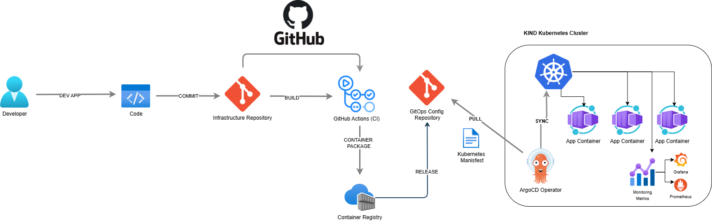

# infrastructure-repo-argocd — Pull-Based GitOps (ArgoCD)

> **MSc Thesis companion repository** · *GitOps Efficiency with ArgoCD Automation*
> Marcel Marques Martins · ISCTE – Instituto Universitário de Lisboa · December 2024

This repository implements the **pull-based GitOps** scenario used as the experimental group in the thesis evaluation (Chapters 5 & 6). ArgoCD continuously watches this repository and reconciles the cluster state automatically — the CI pipeline never touches the cluster directly. Compare with [`infrastructure-repo`](https://github.com/triplom/infrastructure-repo) for the push-based control group.



---

## Architecture

```
┌─────────────────────────────────────────────────────────────────┐
│                    Pull-Based GitOps Flow                        │
│                                                                  │
│  Git push → GitHub Actions CI → Build image → Push to Hub       │
│                    ↓                                             │
│         Update Kustomize manifest in Git (commit)               │
│                    ↓                                             │
│         ArgoCD detects change → pulls from Git                  │
│                    ↓                                             │
│         Applies desired state to Kubernetes cluster             │
│                                                                  │
│  ArgoCD owns cluster state. Self-heals on drift automatically.  │
└─────────────────────────────────────────────────────────────────┘
```

**Key characteristics vs push-based CD:**
- CI commits manifest changes to Git; it never runs `kubectl apply` against the cluster
- ArgoCD polls Git every ~3 minutes and reconciles any detected diff
- Cluster credentials are not required in CI secrets (only needed for the one-time bootstrap)
- Drift is corrected automatically via ArgoCD's self-heal policy

---

## App-of-Apps Pattern

The entire cluster configuration is managed through a nested hierarchy of ArgoCD applications:

```
root  (Helm chart: root-app/)
├── app-of-apps-infra        (Helm chart: app-of-apps-infra/)
│   ├── cert-manager         → infrastructure/cert-manager/
│   ├── cert-manager-config  → infrastructure/cert-manager/
│   └── ingress-nginx        → infrastructure/ingress-nginx/
│
├── app-of-apps-monitoring   (Helm chart: app-of-apps-monitoring/)
│   ├── prometheus           → apps/prometheus/
│   ├── grafana              → apps/grafana/
│   └── alertmanager         → apps/alertmanager/
│
└── app-of-apps              (Helm chart: app-of-apps/)
    ├── app1-<env>           → apps/app1/overlays/<env>/
    ├── app2-<env>           → apps/app2/overlays/<env>/
    ├── external-app1        → apps/external-app1/
    ├── external-app2        → apps/external-app2/
    └── php-web-app          → apps/php-web-app/
```

**Bootstrap sequence:** a single `kubectl apply` of `infrastructure/argocd/applications/root.yaml` registers the root ArgoCD Application. ArgoCD then renders the `root-app` Helm chart, which creates the three child app-of-apps Applications, each of which creates their leaf Applications. All subsequent reconciliation is automatic.

---

## Repository Structure

```
infrastructure-repo-argocd/
├── .github/workflows/
│   ├── ci-pipeline.yaml             # Legacy CI: build + update manifests (GHCR)
│   ├── deploy-argocd.yaml           # One-shot: install ArgoCD + bootstrap root app
│   ├── deploy-infrastructure.yaml   # Validate manifests + bootstrap ArgoCD (KIND)
│   ├── deploy-monitoring.yaml       # Validate + GitOps-commit monitoring changes
│   ├── deploy-apps.yaml             # Build images → update kustomization → ArgoCD syncs
│   └── promote-apps.yaml            # Promote image tag dev → qa → prod via Git commit
├── root-app/                        # Helm chart — creates the three app-of-apps
│   ├── Chart.yaml
│   ├── values.yaml
│   └── templates/
│       ├── app-of-apps.yaml
│       ├── app-of-apps-infra.yaml
│       └── app-of-apps-monitoring.yaml
├── app-of-apps/                     # Helm chart — leaf Application objects for apps
│   ├── Chart.yaml
│   ├── values.yaml
│   └── templates/
│       ├── app1.yaml
│       ├── app2.yaml
│       ├── external-app.yaml
│       └── php-web-app.yaml
├── app-of-apps-infra/               # Helm chart — leaf Application objects for infra
│   ├── Chart.yaml
│   ├── values.yaml
│   └── templates/
│       ├── cert-manager.yaml
│       ├── cert-manager-config.yaml
│       └── ingress-nginx.yaml
├── app-of-apps-monitoring/          # Helm chart — leaf Application objects for monitoring
│   ├── Chart.yaml
│   ├── values.yaml
│   └── templates/
│       └── monitoring-applications.yaml
├── apps/
│   ├── app1/                        # Python Flask app (base + dev/qa/prod overlays)
│   ├── app2/                        # Python Flask app (base + dev/qa/prod overlays)
│   ├── alertmanager/                # Alertmanager (base + dev overlay)
│   ├── external-app1/               # External app (base + dev/qa/prod overlays)
│   ├── external-app2/               # External app (base + dev/qa/prod overlays)
│   ├── grafana/                     # Grafana + dashboards (base + dev overlay)
│   ├── php-web-app/                 # PHP + nginx app (base + dev/qa/prod overlays)
│   └── prometheus/                  # Prometheus (base + dev overlay)
├── infrastructure/
│   ├── argocd/
│   │   ├── base/                    # ArgoCD install manifests (Kustomize)
│   │   ├── applications/            # ArgoCD Application CRDs (root, infra, monitoring)
│   │   ├── projects/                # ArgoCD Project definitions
│   │   └── repositories/            # Repository secret template + setup script
│   ├── cert-manager/                # cert-manager (base + dev/qa/prod overlays)
│   ├── ingress-nginx/               # NGINX Ingress Controller (base + dev/qa/prod overlays)
│   └── monitoring/                  # Monitoring namespace + base config (base + overlays)
├── src/
│   ├── app1/                        # app1 source code + Dockerfile
│   └── app2/                        # app2 source code + Dockerfile
├── kind/
│   ├── clusters/                    # KIND cluster config files (dev/qa/prod)
│   ├── setup-kind.sh                # Provision local KIND clusters
│   └── monitoring-stack.sh          # Install monitoring on a cluster
├── docs/
│   ├── chapter-5-argocd-implementation.md
│   ├── CONTRIBUTING.md
│   ├── KIND-NETWORK-FIX-REPORT.md
│   └── README.md
├── Makefile                         # Common task shortcuts
├── bootstrap.sh                     # One-shot local bootstrap script
├── access.sh                        # ArgoCD + app port-forward helper
└── .pre-commit-config.yaml
```

---

## CI/CD Workflows

### 1. Deploy Infrastructure (`deploy-infrastructure.yaml`)

Validates all manifests (Kustomize + Helm) and bootstraps ArgoCD on the target cluster — the only point where CI interacts with the cluster.

**Triggers:** push to `main` affecting `kind/**`, `infrastructure/argocd/**`, `infrastructure/cert-manager/**`, `infrastructure/ingress-nginx/**`, or `root-app/**`; manual dispatch.

```
validate (kustomize build + helm lint)
  └── bootstrap (if KUBECONFIG set)
        ├── install cert-manager
        ├── install ingress-nginx
        ├── install ArgoCD
        └── apply root application → ArgoCD takes ownership
```

> After bootstrap, ArgoCD manages all further infrastructure changes. CI is no longer required for cluster updates.

### 2. Deploy ArgoCD (`deploy-argocd.yaml`)

Alternative one-shot workflow: installs ArgoCD, configures the SSH repository secret, and registers the root application. Used for initial setup or full re-bootstrap.

**Triggers:** push to `main` affecting `bootstrap.sh`, `root-app/**`, or `infrastructure/argocd/**`; manual dispatch with `bootstrap | sync-all | validate` action.

```
install ArgoCD → configure repo secret → apply root app → validate
```

### 3. Deploy Monitoring (`deploy-monitoring.yaml`)

Validates and commits monitoring manifest changes to Git. ArgoCD detects the commit and reconciles `app-of-apps-monitoring` automatically. An optional `force_sync` input triggers an immediate ArgoCD sync via CLI.

**Triggers:** push to `main` affecting `infrastructure/monitoring/**` or `app-of-apps-monitoring/**`; manual dispatch.

```
validate (helm lint + kustomize build)
  └── gitops-update (commit manifest changes → ArgoCD auto-syncs)
        └── [optional] argocd-sync (force sync via ArgoCD CLI)
```

### 4. Deploy Apps (`deploy-apps.yaml`)

Builds Docker images for `app1` and `app2`, pushes them to Docker Hub, and updates the image tag in the Kustomize overlay for the target environment. The Git commit triggers ArgoCD to sync — no `kubectl` is run by CI.

**Triggers:** push to `main` affecting `src/**` or `apps/**`; pull requests; manual dispatch.

```
build (matrix: app1, app2) → push Docker Hub
  └── gitops-update (update kustomization newTag → git commit → ArgoCD auto-syncs)
        └── argocd-status (report sync status if cluster accessible)
```

### 5. Promote Apps (`promote-apps.yaml`)

Copies the image tag from the source environment's `kustomization.yaml` to the target environment and commits. ArgoCD on the target cluster detects and applies the change — no cluster credentials needed in CI for promotion.

**Triggers:** manual dispatch (choose source env, target env, application, and optional tag); auto-triggered after `Deploy Apps` succeeds on `main`.

```
resolve tag (from source env kustomization or git SHA)
  └── update target env kustomizations → git commit
        └── [optional] argocd-sync (force sync on target cluster)
```

### 6. CI Pipeline (`ci-pipeline.yaml`)

Original CI pipeline — builds images and updates all environment manifests in one pass. Retained for reference; `deploy-apps.yaml` is the primary pipeline for GitOps deployments.

**Triggers:** push to `main` affecting `src/**`; manual dispatch.

---

## Local Setup

### Prerequisites

```bash
# Install required tools
brew install kind kubectl kustomize helm   # macOS
# or apt-get / dnf equivalents on Linux

# Install ArgoCD CLI
curl -sSL -o /usr/local/bin/argocd \
  https://github.com/argoproj/argo-cd/releases/latest/download/argocd-linux-amd64
chmod +x /usr/local/bin/argocd
```

### 1. Provision KIND clusters

```bash
./kind/setup-kind.sh
# Creates: kind-dev-cluster, kind-qa-cluster, kind-prod-cluster
```

### 2. Bootstrap ArgoCD (one-time)

```bash
kubectl config use-context kind-dev-cluster

# Install ArgoCD
kubectl create namespace argocd
kubectl apply -n argocd -k infrastructure/argocd/base

# Wait for ArgoCD to be ready
kubectl wait --for=condition=available --timeout=300s deployment/argocd-server -n argocd

# Register the root application — ArgoCD will do the rest
kubectl apply -f infrastructure/argocd/applications/root.yaml
```

Or use the bootstrap script:

```bash
./bootstrap.sh
```

### 3. Access ArgoCD UI

```bash
kubectl port-forward svc/argocd-server -n argocd 8080:443
# open https://localhost:8080   user: admin

kubectl -n argocd get secret argocd-initial-admin-secret \
  -o jsonpath="{.data.password}" | base64 -d
```

### 4. Access applications and monitoring

```bash
./access.sh   # port-forward helper for all services
# or individually:
kubectl port-forward svc/app1 -n app1-dev 8081:80
kubectl port-forward svc/monitoring-grafana -n monitoring 3000:80
```

### Makefile reference

| Command | Description |
|---|---|
| `make setup-clusters` | Create all KIND clusters |
| `make setup-argocd` | Install ArgoCD on current cluster |
| `make bootstrap-argocd` | Register root ArgoCD application |
| `make get-argocd-password` | Print ArgoCD admin password |
| `make port-forward-argocd` | Forward ArgoCD UI to localhost:8080 |
| `make setup-infra` | Install ingress-nginx + cert-manager + monitoring + ArgoCD |
| `make setup-monitoring` | Install monitoring stack on dev |
| `make port-forward-grafana` | Forward Grafana to localhost:3000 |
| `make port-forward-app` | Forward app1 to localhost:8081 |
| `make clean-clusters` | Delete all KIND clusters |

---

## Multi-Environment Strategy

Three environments are supported: **dev**, **qa**, **prod**. Each has:
- A dedicated KIND cluster (`kind-dev-cluster`, `kind-qa-cluster`, `kind-prod-cluster`)
- Kustomize overlays under `apps/<app>/overlays/<env>/`
- Infrastructure overlays under `infrastructure/<component>/overlays/<env>/`

**Promotion flow (pull-based):**

```
dev cluster ──(promote-apps: git commit)──▶ qa cluster ──(promote-apps: git commit)──▶ prod cluster
                                                ↑                                           ↑
                                         ArgoCD on qa                               ArgoCD on prod
                                         detects commit                             detects commit
                                         and syncs                                  and syncs
```

Each promotion step:
1. Reads the current `newTag` from the source environment's `kustomization.yaml`
2. Writes that tag into the target environment's `kustomization.yaml`
3. Commits and pushes to Git
4. ArgoCD on the target cluster detects the diff and applies — no CI-to-cluster connection needed

---

## Secrets Required

| Secret | Value | Used by |
|---|---|---|
| `DOCKERHUB_USERNAME` | `triplom` | `deploy-apps.yaml`, `ci-pipeline.yaml` |
| `DOCKERHUB_TOKEN` | Docker Hub PAT | `deploy-apps.yaml`, `ci-pipeline.yaml` |
| `PAT` | GitHub PAT (for manifest commits) | `deploy-apps.yaml`, `promote-apps.yaml`, `deploy-monitoring.yaml` |
| `KUBECONFIG` | base64-encoded kubeconfig (bootstrap only) | `deploy-infrastructure.yaml`, `deploy-argocd.yaml` |
| `SSH_PRIVATE_KEY` | SSH key for ArgoCD repo access | `deploy-argocd.yaml` |

Generate the kubeconfig secret:
```bash
cat ~/.kube/config | base64 -w0 | \
  gh secret set KUBECONFIG --repo triplom/infrastructure-repo-argocd
```

> After the initial bootstrap, ArgoCD manages the cluster without needing `KUBECONFIG` in CI. The secret is only consumed by the bootstrap workflows.

### Local homelab note

For a local Kind cluster on `triplom-linux`, the Kubernetes API is commonly bound to
`127.0.0.1` or a private LAN IP. GitHub-hosted runners cannot reach those endpoints.

Supported options:

1. Use a self-hosted GitHub Actions runner on `triplom-linux`
2. Use a routable/tunneled Kubernetes API endpoint
3. Let pull-based GitOps continue locally and have GitHub-hosted workflows skip direct cluster access

Self-hosted runner bootstrap helper:

```bash
RUNNER_TOKEN=<repo-runner-registration-token> \
  ./scripts/setup-self-hosted-runner.sh
```

For the `girus` Kind cluster, bind the API server on the LAN address if you want it reachable from other machines on your network:

```yaml
networking:
  apiServerAddress: "192.168.1.85"
  apiServerPort: 6443
```

---

## Container Images

Images are pushed to Docker Hub under `triplom/`:

| Application | Image |
|---|---|
| app1 | `triplom/app1:<sha-tag>` |
| app2 | `triplom/app2:<sha-tag>` |

---

## Monitoring Stack

Prometheus, Grafana, and Alertmanager are deployed into the `monitoring` namespace and managed by ArgoCD via `app-of-apps-monitoring`. Grafana ships with Kubernetes and ArgoCD dashboards pre-configured.

```bash
kubectl port-forward svc/monitoring-grafana -n monitoring 3000:80
# open http://localhost:3000   user: admin / admin
```

---

## Comparison with Push-Based CD

| Aspect | Push-Based ([infrastructure-repo](https://github.com/triplom/infrastructure-repo)) | Pull-Based (this repo) |
|---|---|---|
| Who applies manifests | CI pipeline (`kubectl apply`) | ArgoCD operator (pull from Git) |
| Cluster credentials in CI | Required (`KUBECONFIG` secret) | Only for one-time bootstrap |
| Drift correction | None — manual re-run needed | Automatic (ArgoCD self-heals) |
| Deployment trigger | Pipeline run | Git commit detected by ArgoCD |
| Promotion mechanism | CI applies to next cluster | CI commits to Git; ArgoCD syncs |
| Audit trail | GitHub Actions logs | Git history + ArgoCD UI |
| Setup complexity | Low (no operator) | Higher (ArgoCD bootstrap) |
| Reconciliation loop | None | Every ~3 minutes |

See Chapter 6 of the thesis for quantitative evaluation metrics.

---

## Related Repositories

| Repository | Purpose |
|---|---|
| [`infrastructure-repo`](https://github.com/triplom/infrastructure-repo) | Push-based CD — thesis control group |
| [`infrastructure-repo-argocd`](https://github.com/triplom/infrastructure-repo-argocd) | This repo — pull-based GitOps with ArgoCD |

---

## License

MIT — see [LICENSE](LICENSE).
